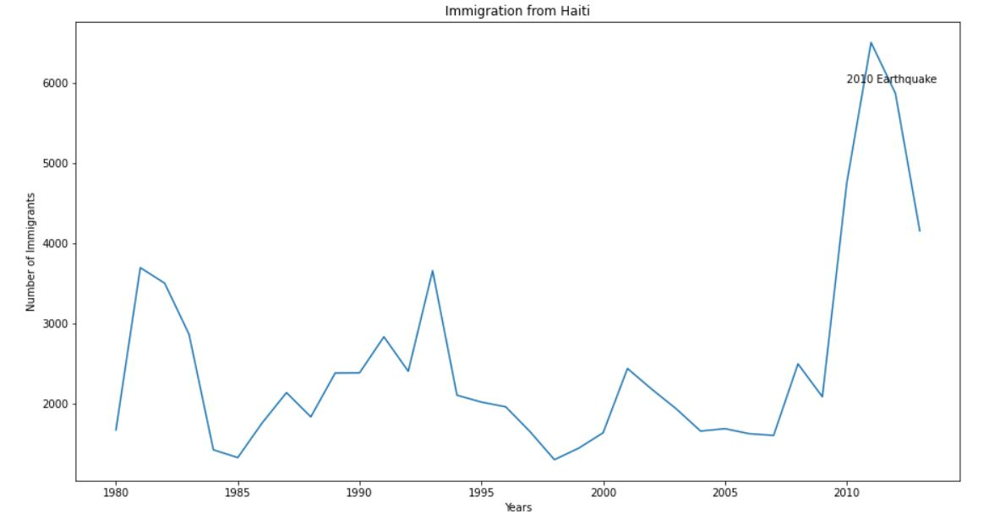
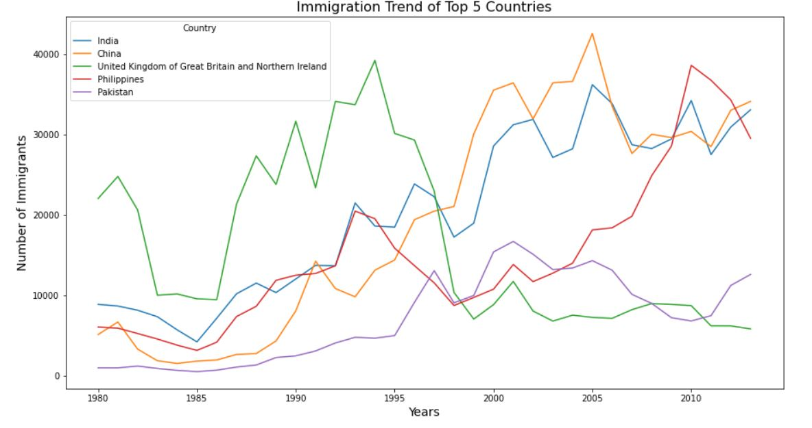
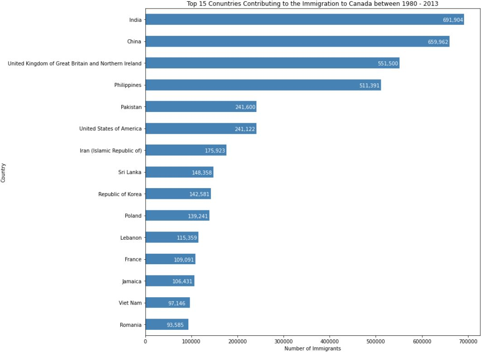
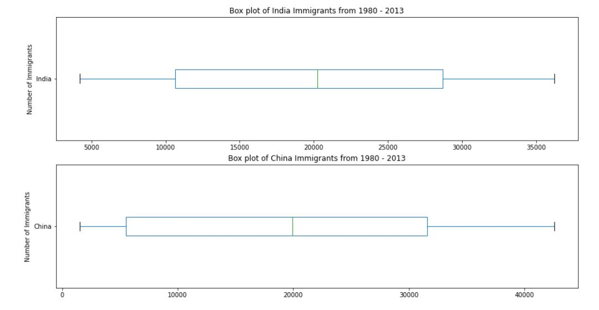
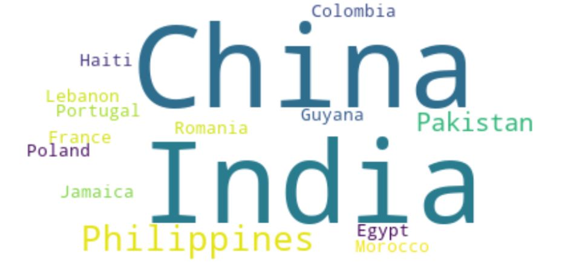
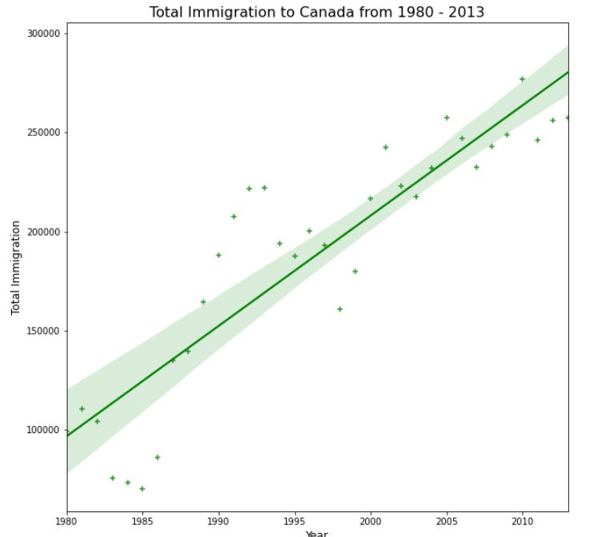

# Data Visualization of Immigration Dataset (Canada from 1983 - 2013)

### This project focuses on the visualization of the Immigration Dataset of Canada from the period 1980 to 2013 in order to analyze, interpret and extract meaningful insights through different visualizations.

It is divided into 2 parts depending on the use of Visualization Tools :

- Using Basic Visualisation Tools - Line Plots, Area Plots, Histograms, Bar Charts, Pie Charts, Box Plots, Sub Plots and Scatter Plots
- Using Advanced Visualistion Tools -Word Clouds and Regression Plots using Seaborn

## Final Thoughts

**In 2010, Haiti suffered a catastrophic magnitude 7.0 earthquake. The quake caused widespread devastation and loss of life and aout three million people were affected by this natural disaster. As part of Canada's humanitarian effort, the Government of Canada stepped up its effort in accepting refugees from Haiti.**

**The 2008 - 2011 Icelandic Financial Crisis was a major economic and political event in Iceland. Relative to the size of its economy, Iceland's systemic banking collapse was the largest experienced by any country in economic history. The crisis led to a severe economic depression in 2008 - 2011 and significant political unrest, which led to an increasing immigration rate to Canada.**

**From the above plot, we can observe that the China and India have very similar immigration trends to canada through the years.**

**We can see that by the end of the 20th century, a continuous increase in the immigration rate from india and Philippines to Canada, while the opposite is the case in United Kingdom of Great Birtain.**

**Top 15 Conuntries Contributing to the Immigration to Canada between 1980 - 2013.**

**We can observe that, while both countries have around the same median immigrant population (~20,000), China's immigrant population range is more spread out than India's. The maximum population from India for any year is around 36,000 while for China is around 43,000**

**Using the equation of line of best fit, we can estimate the number of immigrants in any given year.**

## Advanced Visuals

**China, India, Philippines, Pakistan are the highest in the immigration rate to Canada.**

